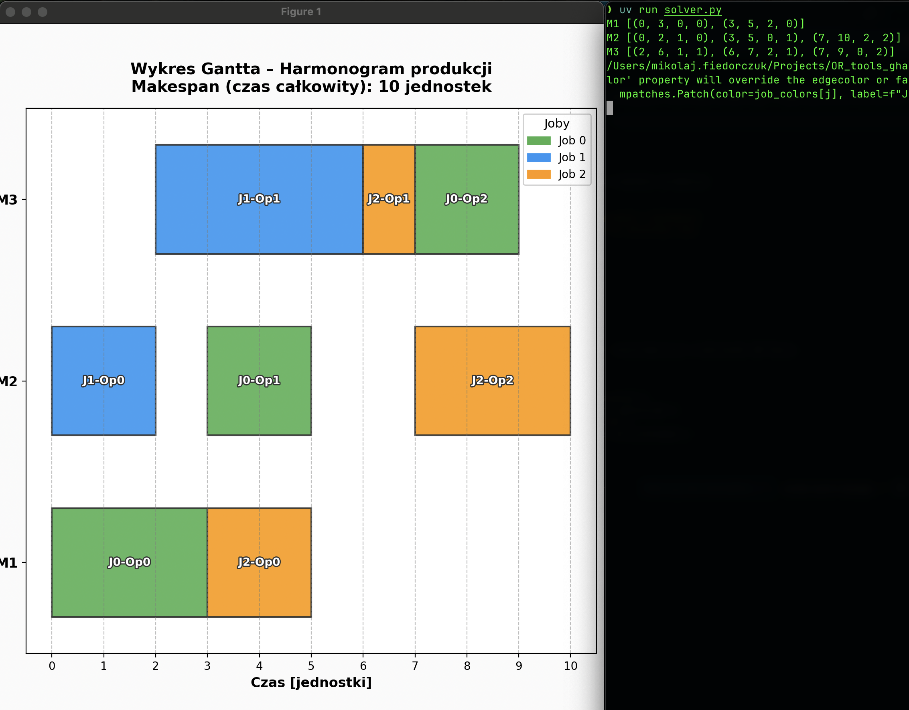

# 🏭 Job Shop Scheduling – POC z OR-Tools

Prosty proof-of-concept optymalizacji harmonogramowania zadań produkcyjnych (Job Shop Scheduling) z wykorzystaniem biblioteki **Google OR-Tools**.

Przykład działania:

---

## 📋 Opis problemu

**Job Shop Scheduling** to klasyczny problem optymalizacyjny w zarządzaniu produkcją:

- Mamy **zbiór jobów** (zleceń produkcyjnych) do wykonania
- Każdy job składa się z **sekwencji operacji** (np. cięcie → spawanie → malowanie)
- Każda operacja musi być wykonana na **konkretnej maszynie** przez określony czas
- **Maszyna może wykonywać tylko jedną operację naraz**
- Cel: **zminimalizować całkowity czas produkcji** (makespan)

---

## 🔧 Wykorzystana technologia

### Google OR-Tools – CP-SAT Solver

Projekt wykorzystuje solver **CP-SAT** (Constraint Programming - Satisfiability) z biblioteki OR-Tools:

| Aspekt | Opis |
|--------|------|
| **Metoda** | Programowanie z ograniczeniami (Constraint Programming) |
| **Solver** | CP-SAT – hybrydowy solver łączący SAT z propagacją ograniczeń |
| **Typ problemu** | Optymalizacja kombinatoryczna z ograniczeniami |
| **Złożoność** | NP-trudny (Job Shop jest jednym z najtrudniejszych problemów) |

**Dlaczego CP-SAT?**
- Specjalizuje się w problemach schedulingowych
- Wbudowane wsparcie dla `IntervalVar` i `add_no_overlap`
- Bardzo szybki dla małych/średnich instancji
- Gwarantuje optymalność rozwiązania (jeśli znajdzie)

---

## 📥 Dane wejściowe (Input)

```python
# Lista maszyn dostępnych w fabryce
machines = ["M1", "M2", "M3"]

# Definicja jobów: każdy job to lista operacji
# Format operacji: (id_maszyny, czas_trwania)
jobs = [
    [(0, 3), (1, 2), (2, 2)],  # Job 0: M1(3h) → M2(2h) → M3(2h)
    [(1, 2), (2, 4)],          # Job 1: M2(2h) → M3(4h)
    [(0, 2), (2, 1), (1, 3)],  # Job 2: M1(2h) → M3(1h) → M2(3h)
]
```

### Struktura danych wejściowych:

| Parametr | Typ | Opis |
|----------|-----|------|
| `machines` | `list[str]` | Nazwy/identyfikatory maszyn |
| `jobs` | `list[list[tuple]]` | Lista jobów, każdy zawiera operacje `(machine_id, duration)` |

---

## 📤 Dane wyjściowe (Output)

```python
# Harmonogram per maszyna: (start, koniec, job_id, operacja_id)
schedule = {
    0: [(0, 3, 0, 0), (3, 5, 2, 0)],      # M1: Job0-Op0, potem Job2-Op0
    1: [(0, 2, 1, 0), (3, 5, 0, 1), ...],  # M2: Job1-Op0, potem Job0-Op1, ...
    2: [(2, 6, 1, 1), (6, 7, 2, 1), ...],  # M3: ...
}

# Kluczowy KPI
makespan = 10  # Całkowity czas produkcji (jednostki czasu)
```

### Struktura danych wyjściowych:

| Parametr | Typ | Opis |
|----------|-----|------|
| `schedule` | `dict[int, list[tuple]]` | Harmonogram dla każdej maszyny |
| `makespan` | `int` | Minimalny czas zakończenia wszystkich jobów |
| Wykres Gantta | `matplotlib` | Wizualizacja harmonogramu |

---

## 🏭 Zastosowanie w systemie produkcyjnym

### Potencjalne rozszerzenia dla realnego wdrożenia:

```
┌─────────────────────────────────────────────────────────────────┐
│                    SYSTEM PRODUKCYJNY                           │
├─────────────────────────────────────────────────────────────────┤
│                                                                 │
│  ┌─────────────┐     ┌──────────────┐     ┌─────────────────┐  │
│  │   ERP/MES   │────▶│  OR-Tools    │────▶│  Harmonogram    │  │
│  │  (zlecenia) │     │  Scheduler   │     │  (Gantt/Raport) │  │
│  └─────────────┘     └──────────────┘     └─────────────────┘  │
│        │                    │                      │            │
│        ▼                    ▼                      ▼            │
│  • Nowe zamówienia   • Optymalizacja       • Kolejka na        │
│  • Priorytety        • Minimalizacja         maszyny           │
│  • Terminy             przestojów          • Alerty opóźnień   │
│  • Dostępność        • Balansowanie        • Eksport do        │
│    maszyn              obciążenia            sterowników       │
│                                                                 │
└─────────────────────────────────────────────────────────────────┘
```

### Realne rozszerzenia algorytmu:

| Funkcjonalność | Jak zaimplementować |
|----------------|---------------------|
| **Priorytety zleceń** | Wagi w funkcji celu lub ograniczenia terminów |
| **Dostępność maszyn** | Dodatkowe `IntervalVar` dla okien serwisowych |
| **Przezbrojenia** | Zmienne czasów przejścia między operacjami |
| **Wiele zasobów na operację** | Rozszerzenie `by_machine` o operatorów/narzędzia |
| **Terminy dostaw** | Ograniczenia `end <= deadline` dla jobów |
| **Minimalizacja WIP** | Alternatywna funkcja celu (flow time) |

---

## 🚀 Uruchomienie

```bash
# Instalacja zależności
uv sync

# Uruchomienie solvera
uv run python solver.py
```

---

## 📁 Struktura projektu

```
├── solver.py          # Główny solver OR-Tools (model + rozwiązanie)
├── visualization.py   # Moduł wizualizacji wykresu Gantta
├── pyproject.toml     # Konfiguracja projektu i zależności
└── README.md          # Dokumentacja
```

---

## 📚 Materiały

- [Google OR-Tools Documentation](https://developers.google.com/optimization)
- [Job Shop Scheduling Tutorial](https://developers.google.com/optimization/scheduling/job_shop)
- [CP-SAT Primer](https://developers.google.com/optimization/cp/cp_solver)
